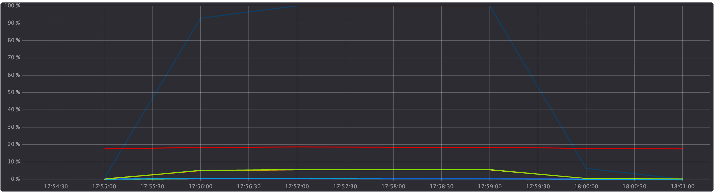

# ML System Design Doc - [RU]
[ML System Design Doc в Google Doc](https://docs.google.com/document/d/1CI9ggCAFSKsd5e3XjWmvZ4EXBDerGNPkh2qS21IPdIg/edit?usp=sharing)
## Дизайн ML системы - nanozymes_ai (MVP). вер.1.4 </h1>

Текущий этап разработки системы машинного обучения - запуск сервиса в производственную среду. Разработка моделей для создания эмбеддингов успешно завершена, и их оптимизация проведена. Архитектура решения полностью спроектирована. Бизнес-требования к проекту четко сформулированы, а проблемное интервью с заинтересованными сторонами успешно проведено.

### 1. Цели и предпосылки
#### 1.1. Бизнес-цель разработки продукта
- Разработать помощник для изучения научных статей по химии на основе размеченных экспертами данных, состоящих из 406 научных статей и таким образом сократить время ученых-химиков на изучение больших текстов из доменной области на 50%. Помощник подлежит интеграции в существующий сайт https://dizyme.aicidlab.itmo.ru.
В каждой статье от 10 до 50 страниц, на изучение одной статьи тратится до 4 часов. Разрабатываемый сервис должен позволять уменьшать это время до 2 часов за счет information retrieval текста.

Успехом текущей итерации с точки зрения бизнеса будем считать сокращение до 2 часов времени на выделение из научных статей описания способа получения химического соединения. С технической точки зрения сервис должен давать ответ на любой вопрос относительно любой статьи из базы данных https://dizyme.aicidlab.itmo.ru/database/.
  
#### 1.2. Бизнес-требования и ограничения

Детальные бизнес-требования, включая User case, приведены в отдельном документе, доступном по ссылке: [ссылка](https://docs.google.com/document/d/1wzRkxla2tKxWpdSKJyNufT7vK5zfY5HU0-tbEOxiyjY/edit?usp=sharing)

Создаем сервис, позволяющий в научных статьях выделять данные, отвечающие на вопрос пользователя. Например, сервис должен найти в тексте статьи инструкцию по синтезу химического вещества, информацию о каталитической активности и т.п.

Ограничения:

- Нужно получать информацию только из содержимого научных статей, без подмешивания других данных. Это позволит сохранить достоверность ответа с научной точки зрения.

- Лучше, когда модель не находит нужных данных, чем когда находит их неверно.

 
Пилот текущей итерации разработки:

Бизнес-процесс пилота проводится на рабочей среде, т.к. представляет собой отдельный сервис с отдельным сценарием использования и не нарушает существующих пользовательских сценариев даже в случае неуспешной работы.
Пилот предваряется тестированием, программа и результаты тестирования (ПиМИ) описаны в отдельном документе, доступном по ссылке: [ссылка](https://docs.google.com/document/d/1e3Ra_L9b0mVouIHQA7WWUyZv06V_0ZWRHS-J0tQwqHw/edit?usp=sharing)
   
  > - Результат работы помощника в процессе пилота оценивает эксперт доменной области, критерии оценки - такие же, как критерии тестирования, приведены по ссылке выше. Успешным будем считать пилот, в ходе которого сохраняется на целевом уровне количество субъективных оценок распознавания выше 5 баллов - не менее 75%.

#### 1.3. Скоуп проекта
 В текущей итерации реализуем систему распознавания заданного типа текста (параметры синтеза нанозимов) в научных статьях. Поиск текста осуществляется по отдельной, выбранной пользователем, статье. Сквозной поиск ответа на запрос по всем статьям из базы данных в текущей итерации реализован не будет.

Качество кода и воспроизводимость:

  - Код удовлетворяет PEP8.
  - Для воспроизводимости решения используется docker файл с инструкцией по запуску.
  
Планируемый технический долг (на следующие итерации):
  - Извлечение из текста статьи числовых параметров.
  - Загрузка пользователем новых статей в различных форматах (epub, сканы документов). 
  - Классификация научных статей. Определение доменной области, к которой относится статья, при ее загрузке в базу данных, построение эмбеддингов статьи.
  - Проверка прав на использование контента при его загрузке.

  
#### 1.4. Предпосылки решения

  - Используем только тексты научных статей из базы данных
  - Проект ведется в GitHub
  - Для работы сервиса используются предобученные модели, тестируется подача на вход различных форматов данных
  - Стек: python, C#, Reac

### 2. Методология#### 2.1. Постановка задачи

Для предикта текст статьи:

- Делится на фрагменты длиной N символов, 
- Фрагменты передаются модели multilingual-e5-large для построения эмбеддингов,
- Строится той же моделью эмбеддинг запроса пользователя,
- Выбирается k фрагментов текста, косинусное расстояние между эмбеддингами которых и эмбеддингом запроса наименьшее,
- к каждому из k, фрагментов добавляется q фрагментов до и столько же после,
- k таких наборов данных в формате JSON по API передаются модели OpenAI. 
- Возвращается ответ в формате JSON или .xml для отображения в области распознанного текста
- Извлечение данных из текста будет производиться на основе языковых моделей

Для извлечения эмбеддингов из фрагментов текста выбрана модель multilingual-e5-large. Критериями выбора являются качество и производительность. Сравнение производилось на лидерборде https://github.com/avidale/encodechka
Бейзлайн для оценки качества модели в текущем проекте - сравнение с качеством работы человека.
Целевые метрики работы модели:
1) Распознавание в тексте статьи описания. Precision - 90%
2) Полнота - количество правильно распознанных слов в описании. Recall - 80%.

Блок-схема решения (Часть 1: Схема работы сервиса)

Блок-схема решения (Часть 2: Этапы проекта)

#### 2.3. Этапы решения задачи  
- Этап 0. Данные собраны, размечены вручную: датасет со ссылками на статьи, с выделенными ответами на типовые запросы пользователей (см. вопросы для тестирования в ПиМИ). Датасет предоставлен аспиранткой ИТМО Юлией Разливиной и содержит данные на основе 406 научных статей.

  #### Структура данных
  
| Наименование       | 
| ------------------ |
| Название статьи    |                                          
| Текст статьи       |     
| formula            |     
| activity           |     
| Syngony            |     
| length, nm         |     
| width, nm          |    
| depth, nm          |    
| surface            |      
| pol                |      
| surf               |      
| Mw(coat), g/mol    |      
| Km                 |      
| Vmax, mM           |      
| ReactionType       |     
| C min              |      
| C max              |      
| link               |     

- Этап 1. Построение моделей, тестирование, определение оптимальных параметров
  - Подготовка данных: деление текста на фрагменты. Это требуется для экономии токенов, отправляемых API OpenAI
    По результатам тестирования (Этап 2, параметры тестирования описаны в документе https://docs.google.com/document/d/1e3Ra_L9b0mVouIHQA7WWUyZv06V_0ZWRHS-J0tQwqHw/edit) выбрана длина каждого фрагмента 100 символов
  - Построение эмбеддингов всех фрагментов текста и эмбеддинга запроса. Эмбеддинг запроса строится без его деления на фрагменты.
    Для извлечения эмбеддингов из фрагментов текста выбрана предобученная модель multilingual-e5-large. Критериями выбора являются качество и производительность Сравнение производилось на лидерборде https://github.com/avidale/encodechka
  - Для сравнения эмбеддингов выбрано косинусное расстояние - это стандарт в NLP. Определяется один ближайший к запросу фрагмент текста статьи 
  - Определение q фрагментов, примыкающих к ближайшему к запросу фрагменту текста статьи
    q фрагментов - состоит по результатам тестирования найдено оптимальное значение параметра q=20.
  - Отдаем модели для поиска ответа: запрос и k наборов из 20-1-20 фрагментов
    По результатам тестирования найдено оптимальное значение k=2

- Этап 2. Для тестирования использована выборка 10 случайных статей
- Этап 3. Демо заказчику, тестирование согласно сценариям, описанным в [ПиМИ](https://docs.google.com/document/d/1e3Ra_L9b0mVouIHQA7WWUyZv06V_0ZWRHS-J0tQwqHw/edit)финальное определение параметров модели по результатам тестирования
- Этап 4. Внедрение финальных значений параметров N, k, q в работу модели
- Этап 5. Внедрение моделей в промышленный контур - после настройки выделенного сервера с VPN - для отправки запроса модели OpenAI
- Этап 6. Подготовка финального отчета, в котором задокументированы результаты работы сервиса при различных параметрах (из Этапа 1), зафиксированы параметры, при которых работа сервиса удовлетворяет требованиям заказчика (из Этапа 3)

### 3. Подготовка пилота  

#### 3.1. Способ оценки пилота  
Порядок тестирования, критерии (метрики) успешности описаны в [программе и методике испытаний](https://docs.google.com/document/d/1wzRkxla2tKxWpdSKJyNufT7vK5zfY5HU0-tbEOxiyjY/edit?usp=sharing)

#### 3.2. Подготовка пилота Data Scientist
Для запуска пилота (после успешного прохождения тестирования) требуется 
- наличие выделенного сервера с VPN для организации обращений к OpenAI
- загрузка предрассчитанных эмбеддингов в базу данных со статьями

### 4. Сервис 

#### 4.1. Архитектура решения
​	Общая архитектура решения для production совпадает с архитектурой для пилотной версии. 

#### 4.2. Инфраструктура и масштабируемость
Инфраструктура, в которой работает компонент:
- Главный сервер - aicltr (192.168.63.20). Сервер является точкой входа на кластер, внешний ip - 77.234.216.100, aicltr.itmo.ru. Характеристики
- 40-ядер, процессор Intel(R) Xeon(R) Silver 4210R CPU @ 2.40GHz, 64 GB RAM.
Этот сервер не используется для расчетов, так как на нем работают важные сервисы, такие как apache, LDAP, etc.

Вычислительные ноды кластера:

- Сервер aichem (192.168.63.12). Характеристики: 
6 GPU a6000, 256 ядер, процессор AMD EPYC 7763 64-Core Processor, 512 GB RAM.
Этот сервер нельзя использовать через ssh, только через Slurm.

Сервер aihub (192.168.63.10). Харктеристики:
- 6 GPU a6000, 256 ядер, процессор AMD EPYC 7763 64-Core Processor, 512 GB RAM.
Этот сервер нельзя использовать через ssh, только через Slurm.

#### 4.3.  Потенциальное расширение системы

Возможны следующие варианты расширения системы:
- Сквозной поиск данных по всем статьям из базы данных
- Расширение базы данных за счет научных статей из других доменных областей

Ссылка на сервис: https://dizyme.aicidlab.itmo.ru/

#### 4.4. Способы масштабирования сервиса 

Зачем бизнесу масштабирование? 
Чтобы решить проблемы с задержкой ответа для пользователя, чтобы суметь обрабатывать больше запросов пользователей одновременно.

В терминах вертикального масштабирования можно нарастить объемы оперативной памяти на используемых серверах.
В терминах горизонтального масштабирования можно докупить большее количество серверов, развернуть сервис на каждом из них и настроить балансировку нагрузки.

Подробнее про горизонтальное масштабирование

Подразумевается переход на микросервисную архитектуру. Из архитектуры решения (п. 4.1) очевидно, что возможно выделить несколько bounded context`ов: 
  - Обработка документов
  - Извлечение\поиск параметров
  - Отправка вопроса
  - Составление эмбеддингов
  - Векторизованное представление документа
  - Предоставление ответа на вопрос

Для каждого контекста создается отдельный микросервис. Для балансировки запросов планируется использовать nginx, во избежание просадки производительности. 
Можно полностью отказаться от использования ChatGPT в пользу создания собственного решения. 
Обработка документов может быть полность автоматизирована и переведена в фоновый режим, результаты обработки будут рассчитываться с использованием pull-модели во время плановых технических работ, при этом ресурсы на обработку будут оплачиваться в рамках поддержки и сопровождения разработанного решения.

Методы масштабирования сервиса выбраны исходя из приведенных контекстов.

#### 4.5. Стресс-тест

Стресс-тестирование сервиса проводилось с помощью самописного скрипта распадоденного в корне проекта в папке /stress-tests.
Результатами тестирования оказались два файла. Первый файл показывает распределение нагрузки:

Легенда
 - Синяя линия показывает достигнутую максимальную скорость отправки запросов в единицу времени в процентном соотношении
 - Красная линя показывает нагрузку сервера по памяти
 - Зеленая линия показывает нагрузку по процессору

Второй файл является логом обработки запросов, находится в корне проекта в папке /stress-tests.
Лог показывает статус ответа и время затраченное на обработку запроса. Очевидно ясно видно, что
по результатам тестироания оказалось, что среднее время отклика сервера на один запрос составило 13.4 секунды.

Результаты стресс-теста команда оценивает как великолепные, за время тестирования не произошло ни одного отказа или сбоя системы.